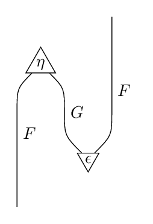
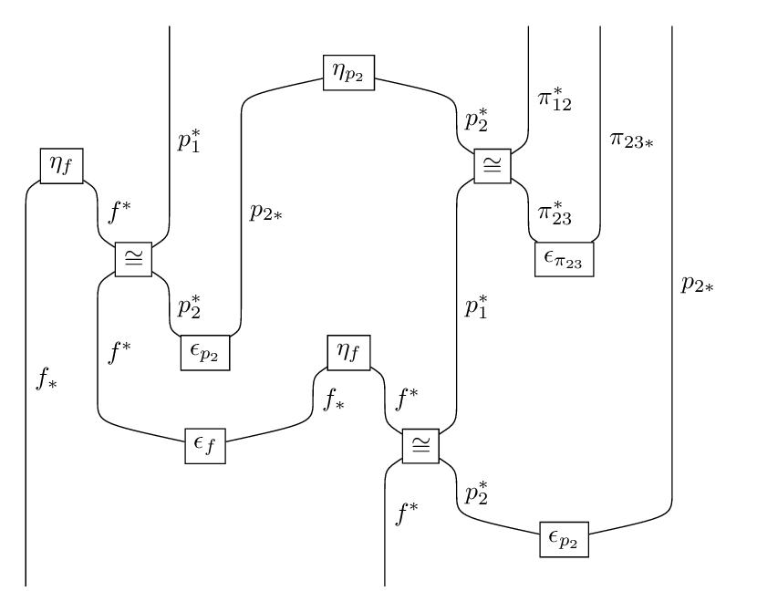

# tikzsd

tikzsd is a Haskell program used to generate
LaTeX code for string diagrams.

To use the program, one defines the categories, functors and natural transformations
to be used, specifying data such as labels and shapes.
After doing this, one can generate the LaTeX for images such as

by simply describing the desired natural transformation and telling the program
how to space the strings.

The first example above was described (after defining `F`, `G`, `unit` and `counit`) using the code

    f : & & F \\
    n : unit & \\
    f : F & G & F \\
    n : & counit \\
    f : F & & \\

while the second example above was described using the code

    f : & & p1b & & & & & pi12b & pi23f & p2f \\
    n : & p2-unit & & & \\
    f : & & p1b & p2f & & & p2b & pi12b & pi23f & p2f \\
    n : f-unit & & & p2pi12b-p1pi23b-iso & & \\
    f : ff & fb & p1b & p2f & & & p1b & pi23b & pi23f & p2f \\
    n : & fp1b-fp2b-iso & & & pi23-counit & \\
    f : ff & fb & p2b & p2f & & & p1b & & & p2f \\
    n : & & p2-counit & f-unit & & \\
    f : ff & fb & & & ff & fb & p1b & & & p2f \\
    n : & f-counit & fp1b-fp2b-iso & \\
    f : ff & & & & & fb & p2b & & & p2f \\
    n : & & p2-counit \\
    f : ff & & & & & fb \\

(again, after suitable definitions).

Moreover, the program also verifies that your functors and natural transformations
actually compose, and prints an error message if it detects something is wrong.

## Usage

Please check out the user's manual
available in the folder `doc/user-manual` for details on how to use the program.

The folder `doc/examples` contains examples of documents whose string diagrams
were generated with tikzsd, along with all relevant source files.
Currently, there is a writeup of a proof of the Benabou-Roubaud theorem,
    from which the above two diagrams were taken.

## Installation

This is a Haskell project.
One can clone the repository, then run `stack install` in the cloned repository
    to compile and install.
I plan on uploading to hackage,
    and may create prebuilt binaries in the future.

## Other

Comments, suggestions, contributions are welcome. 
The user manual contains a roadmap for some future features.
